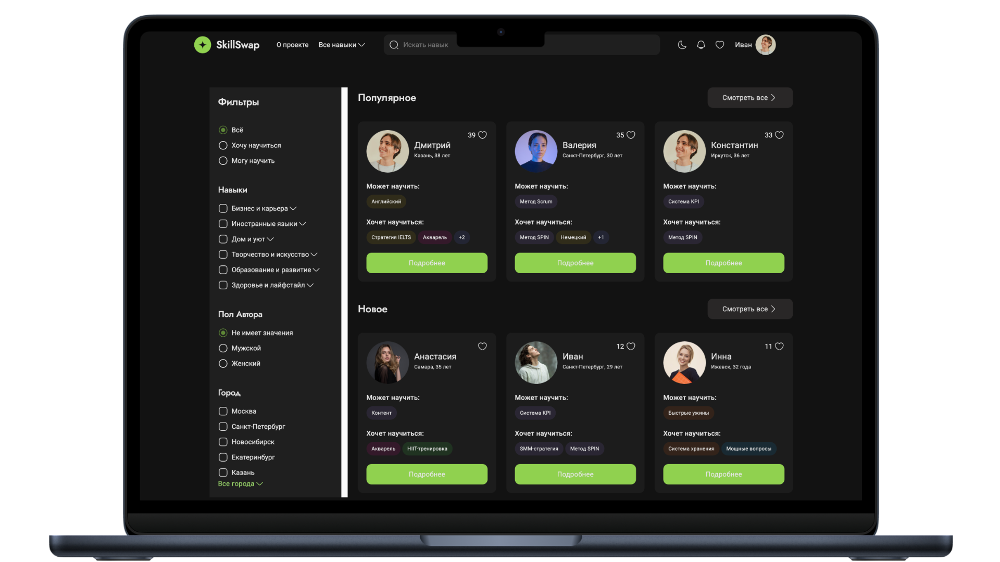

# Skills Swap

       

[Открыть Demo](https://skills-swap-m-pavlov.vercel.app/)

## Описание

Платформа для обмена навыками между пользователями: находи людей, которые могут научить тебя, и делись своими знаниями.

**Функционал**

...
